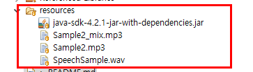
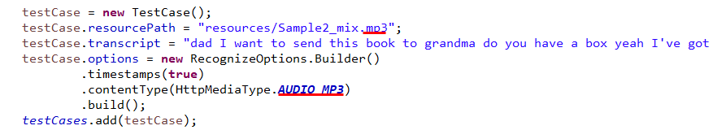

# Mglish
Eclipse, Java, Watson SDK

## How to Add Testcases



- put audio file in the resource folder.



- put some code in the initTestCases() which located in DashboardApp.java

## Results

```
Speaker 1 : Dad,	 [0.00 ~ 0.69]
Speaker 1 : I		 [0.69 ~ 0.86]
Speaker 1 : want	 [0.86 ~ 1.19]
Speaker 1 : to		 [1.19 ~ 1.35]
Speaker 1 : send	 [1.35 ~ 1.67]
Speaker 1 : this	 [1.67 ~ 1.83]
Speaker 1 : book	 [1.83 ~ 2.28]
Speaker 1 : to		 [2.28 ~ 2.44]
Speaker 1 : grandma	 [2.44 ~ 3.23]
Speaker 1 : do		 [3.29 ~ 3.44]
Speaker 1 : you		 [3.44 ~ 3.67]
Speaker 1 : have	 [3.67 ~ 3.95]
Speaker 1 : a		 [3.95 ~ 4.05]
Speaker 1 : box?	 [4.05 ~ 4.72]
Speaker 2 : Yeah.	 [5.24 ~ 5.70]
Speaker 2 : I've	 [5.70 ~ 0.00]
Speaker 2 : got		 [0.00 ~ 6.61]
Speaker 2 : this	 [6.61 ~ 6.87]
Speaker 2 : one		 [6.87 ~ 7.15]
Speaker 2 : to		 [7.15 ~ 7.26]
Speaker 2 : put		 [7.26 ~ 7.48]
Speaker 2 : photo	 [7.54 ~ 7.84]
Speaker 2 : albums	 [7.84 ~ 8.28]
Speaker 2 : in		 [8.28 ~ 8.54]
Speaker 2 : but		 [8.54 ~ 9.28]
Speaker 2 : it's	 [9.28 ~ 9.47]
Speaker 2 : a		 [9.47 ~ 9.57]
Speaker 2 : bit		 [9.57 ~ 9.81]
Speaker 2 : small.	 [9.81 ~ 10.32]
Speaker 1 : The		 [10.32 ~ 10.87]
Speaker 1 : box		 [10.87 ~ 11.41]
Speaker 1 : looks	 [11.41 ~ 11.70]
Speaker 1 : big		 [11.70 ~ 11.93]
Speaker 1 : enough	 [11.93 ~ 12.26]
Speaker 1 : for		 [12.26 ~ 12.48]
Speaker 1 : the		 [12.48 ~ 12.60]
Speaker 1 : book	 [12.60 ~ 13.03]
Speaker 1 : can		 [13.52 ~ 13.71]
Speaker 1 : I		 [13.71 ~ 13.81]
Speaker 1 : use		 [13.81 ~ 14.11]
Speaker 1 : it?		 [14.11 ~ 14.30]


Speaker 1 : Dad, I want to send this book to grandma do you have a box? 
Speaker 2 : Yeah. I've got this one to put photo albums in but it's a bit small. 
Speaker 1 : The box looks big enough for the book can I use it? 

```
